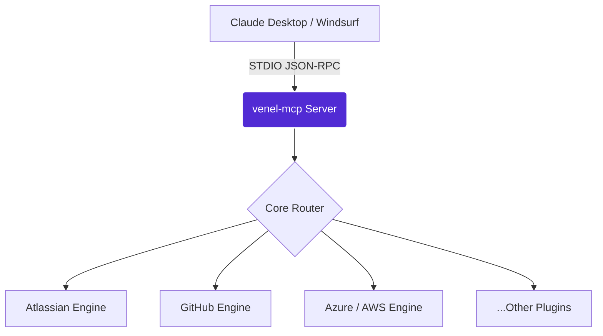

# VenEl MCP Assistant 🚀

[](https://www.nuget.org/packages/VenEl.AssistantMCP/)
[](https://github.com/venkateshellur/VenEl.AssistantMCP/actions)

An enterprise-grade **Model Context Protocol (MCP)** STDIO server built entirely in **.NET**. 

VenEl MCP Assistant seamlessly connects advanced AI assistants (like **Claude Desktop** and **Windsurf**) directly to your enterprise infrastructure, cloud providers, and daily developer tools.

---

## ✨ Features

VenEl isn't just a simple bridge—it features an intelligent, self-healing core designed for long-running IDE sessions:

* **Dynamic API Auto-Healing:** Automatically detects expired/revoked API keys (e.g., Atlassian 410 errors) and seamlessly rotates tokens without crashing the server.
* **Intelligent API Caching:** Built-in `DelegatingHandler` caching prevents rate-limits and accelerates duplicate AI queries.
* **Proactive Update Checker:** Periodically polls NuGet in the background, notifying you in Claude/Windsurf when new integrations drop.
* **Universal Compatibility:** Multi-targets `.NET 8`, `.NET 9`, and `.NET 10` to ensure seamless `dotnet tool install` on any developer machine.

### 🔌 Integrations Matrix

The server acts as a unified hub. You can load all tools at once, or filter them by feature category!

| Integration | Description | Feature Flag |
| :--- | :--- | :--- |
| **AWS** | Manage EC2, S3, IAM, and query AWS infrastructure. | `AWS` |
| **Azure** | Provision resources, inspect ARM templates, and manage Entra. | `Azure` |
| **Atlassian** | Jira ticket management, Confluence search, auto-healing auth. | `Atlassian` |
| **Bitwarden** | Securely fetch secrets and inject them directly into AI contexts. | `Bitwarden` |
| **Databricks** | Query clusters, run jobs, and inspect notebooks. | `Databricks` |
| **Docker** | Manage local containers, images, and docker-compose stacks. | `Docker` |
| **GitHub** | Code search, PR reviews, issue management, and Actions triggers. | `GitHub` |
| **GCP** | Google Cloud resource management and BigQuery integration. | `GCP` |
| **Kubernetes** | Inspect pods, read logs, and manage deployments (`kubectl` bridge). | `Kubernetes` |
| **Microsoft Teams** | Send messages, read chats, and interact with Teams channels. | `MicrosoftTeams` |
| **MSSql** | Execute queries, analyze schema, and format SQL results. | `MSSql` |
| **Slack** | Message channels, thread replies, and workspace search. | `Slack` |
| **Local Office** | Interact with local system files and productivity tools. | `LocalOffice` |

---

## 🚀 Quick Start

### 1. Install as a .NET Global Tool (Recommended)
Because VenEl is published to NuGet, you can install it globally in one command. *(Requires .NET 8, 9, or 10 SDK)*:

```bash
dotnet tool install -g VenEl.AssistantMCP
```
*This installs the `venel-mcp` executable to your system path.*

**Alternatively:** You can download a standalone, self-contained zip for Windows/Mac/Linux directly from the [GitHub Releases](https://github.com/venkateshellur/VenEl.AssistantMCP/releases) page.

### 2. Configure Claude Desktop
Add the server to your `claude_desktop_config.json` (located at `~/Library/Application Support/Claude/claude_desktop_config.json` on Mac, or `%APPDATA%\Claude\claude_desktop_config.json` on Windows):

```json
{
  "mcpServers": {
    "venel-assistant": {
      "command": "venel-mcp",
      "args": []
    }
  }
}
```

### 3. Load Specific Integrations (Optional)
If you prefer to split your tools into separate AI servers (for security or logical grouping), you can use the `--feature` flag!

```json
{
  "mcpServers": {
    "venel-azure-ops": {
      "command": "venel-mcp",
      "args": ["--feature", "Azure", "--feature", "Docker"]
    },
    "venel-productivity": {
      "command": "venel-mcp",
      "args": ["--feature", "Atlassian", "--feature", "Slack"]
    }
  }
}
```

---

## 🔐 Configuration & Authentication

On first run, the tool automatically generates a local configuration directory at:
**`~/.venel-mcp/appsettings.json`**

Open this file and populate the necessary API keys and endpoints for the integrations you wish to use. The server safely parses these on startup and injects them into the HTTP clients.

---

## 🏗️ Architecture



Developed by Venkatesh Ellur.
