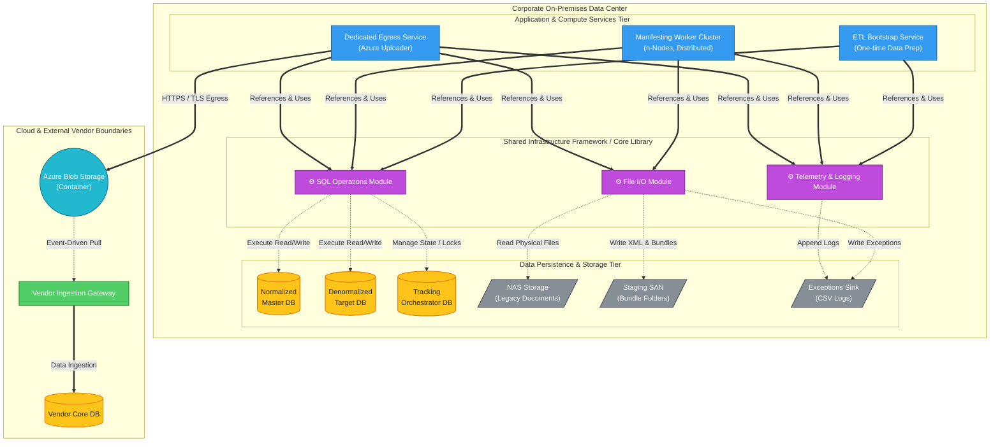

# Enterprise Data Migration Architecture

This architectural topology represents a true N-Tier enterprise design. It explicitly models the **Shared Core Infrastructure Library** that standardizes data access, logging, and file operations across all application services, ensuring clean abstraction between the compute tier and the persistence tier.

## Architectural Design Decisions

1. **N-Tier Architecture with Shared Core:** 
   - A dedicated **Shared Infrastructure Framework** encapsulates all low-level SQL execution, File I/O, and Telemetry/Logging. 
   - This ensures the `Compute Tier` (ETL, Workers, and Uploader) remains purely focused on business logic (flattening data, validating rules, generating XML manifests, uploading). 
   - Code duplication is eliminated; if a database connection string or file path strategy changes, it only changes in the Core Library.

2. **Clean Separation of Storage vs Compute:** 
   - Compute nodes do not talk directly to the databases or NAS. They route all requests through the Core framework, representing a robust Enterprise Data Access Layer (DAL).

3. **State Management & Concurrency:**
   - The `Tracking Orchestrator DB` acts as a distributed lock manager. The `Manifesting Cluster` independently leases batches of work through the `CoreSQL` module, preventing race conditions across the network.

4. **Exception Handling & Auditing:**
   - Empty (0kb) files or corrupt records trigger the `CoreFile` and `CoreLog` modules to immediately route errors to a local CSV exception sink, maintaining a clean cloud egress pipeline.

5. **Strict Network Boundaries:**
   - The architecture explicitly defines trust boundaries: the Corporate On-Premises Data Center, the Microsoft Azure Cloud, and the external Vendor Network. Handoff occurs securely via Azure Blob Storage.
